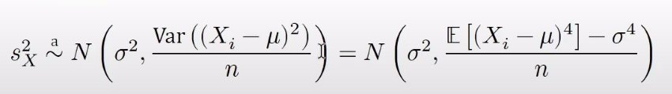
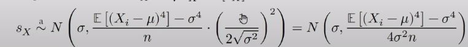

```{r setup, include=FALSE}
knitr::opts_chunk$set(echo = TRUE)
library(tidyverse)
library(boot)

```

Імпорт даних і підготовка.

```{r}

diabetes_data <- read_csv("prepared_data.csv")

sex_categories <- c("female", "male")

gen.hlth_categories <- c("excellent", "very good",
                         "good", "fair", "poor")

age_categories <- c("18-24", "25-29", "30-34", "35-39",
                    "40-44", "45-49", "50-54", "55-59",
                    "60-64", "65-69", "70-74", "75-79",
                    "80+")

edc_categories <- c("No education", 
                    "Elementary", 
                    "Some high school", 
                    "High school graduate", 
                    "Some college or tech. school", 
                    "College graduate")

income_categories <- c("Less than $10,000",
                       "$10,000-$15,000",
                       "$15,000-$20,000",
                       "$20,000-$25,000",
                       "$25,000-$35,000",
                       "$35,000-$50,000",
                       "$50,000-$75,000",
                       "$75,000 or more")

diabetes_data <- diabetes_data %>%
  mutate(
    GenHlth = factor(GenHlth, ordered = TRUE, levels = rev(gen.hlth_categories))
    ) %>%
  mutate(
    Sex = factor(Sex)
    ) %>%
  mutate(
    Age = factor(Age, ordered = TRUE, levels = age_categories)
    ) %>%
  mutate(
    Education = factor(Education, ordered = TRUE, levels = edc_categories)
    ) %>%
  mutate(
    Income = factor(Income, ordered = TRUE, levels = income_categories)
    )

str(diabetes_data, give.attr = FALSE)

```

### Лабораторна робота №2. Статистичне виведення.

## Довірчі інтервали.

В ході виконання першої лабораторної роботи були обчислені такі статистики (для неперервних змінних) BMI, MentHlth, PhysHlth: - Мінімум, максимум.
- Перший квантиль, третій квантиль.
- Вибіркова медіана.
- Вибіркове середнє.
- Вибіркова дисперсія.
- Вибіркове середньоквадратичне відхилення.
\* В частині "Чисельні характеристики неперервних змінни".

#1. Для вибіркових середніх неперервних змінних.

```{r}

# 5% довірчі інтервали для вибіркових середніх неперервних змінних.
BMI_mean_ci <- diabetes_data %>%
  pivot_longer(cols = c(BMI, PhysHlth, MentHlth), names_to = "Variable") %>%
  group_by(Variable) %>%
  summarise(
    mean = format(mean(value), scientific = FALSE),
    sd = format(sd(value), scientific = FALSE),
    left_bound = format(mean(value) + qnorm(0.025) * sd(value) / sqrt(n()), scientific = FALSE),
    right_bound = format(mean(value) + qnorm(0.975) * sd(value) / sqrt(n()), scientific = FALSE)
  )

BMI_mean_ci

```

#2. Для вибіркових дисперсій (і SD).

```{r}

# BMI_variance_ci <- diabetes_data %>%
#   pivot_longer(cols = c(BMI, PhysHlth, MentHlth), names_to = "Variable") %>%
#   group_by(Variable) %>%
#   summarise(
#     variance = var(value),
#     n = n(),
#     left_bound = (n - 1) * variance / qchisq(0.975, df = n - 1),
#     right_bound = (n - 1) * variance / qchisq(0.025, df = n - 1)
#   )

BMI_variance_ci <- diabetes_data %>%
  pivot_longer(cols = c(BMI, PhysHlth, MentHlth), names_to = "Variable") %>%
  group_by(Variable) %>%
  summarise(
    variance = var(value),
      left_bound = variance + qnorm(0.025) * sqrt(var((value - mean(value))^2) / n()),
      right_bound = variance + qnorm(0.975) * sqrt(var((value - mean(value))^2) / n())
  )

BMI_variance_ci

```

До другого варіанту:



SD:

```{r}

# sd_ci <- diabetes_data %>%
#   pivot_longer(cols = c(BMI, PhysHlth, MentHlth), names_to = "Variable") %>%
#   group_by(Variable) %>%
#   summarise(
#     variance = var(value),
#     n = n(),
#     left_bound = sqrt((n - 1) * variance / qchisq(0.975, df = n - 1)),
#     right_bound = sqrt((n - 1) * variance / qchisq(0.025, df = n - 1))
#   )

sd_ci <- diabetes_data %>%
  pivot_longer(cols = c(BMI, PhysHlth, MentHlth), names_to = "Variable") %>%
  group_by(Variable) %>%
  summarise(
    sd_value = sd(value),
    left_bound = sd_value + qnorm(0.025) * sqrt((mean((value - mean(value))^4) - (var(value)^2)) / (4 * var(value) * n())),
    right_bound = sd_value + qnorm(0.975) * sqrt((mean((value - mean(value))^4) - (var(value)^2)) / (4 * var(value) * n()))
  )

sd_ci

```




#3. Для вибіркових медіан неперервних змінних.

```{r}

# Для 1000 також повертає NULL, і в результаті resampl-інгу під час бутстрепу повертається одне й теж саме значення вибіркової медіани - 27.
bmi_median_samples <- boot(data = diabetes_data$BMI, statistic = function(x,i) median(x[i]), R = 200)
boot.ci(bmi_median_samples, type = "norm")

phys_hlth_median_samples <- boot(data = diabetes_data$PhysHlth, statistic = function(x,i) median(x[i]), R = 200)
boot.ci(phys_hlth_median_samples, type = "norm")

ment_hlth_median_samples <- boot(data = diabetes_data$MentHlth, statistic = function(x,i) median(x[i]), R = 200)
boot.ci(ment_hlth_median_samples, type = "norm")

```

Візьмемо перші 10,000 запісів, щоб впевнитися в тому, що справа в розмірі вибірки.

```{r}

bmi_median_samples_cropped <- boot(data = diabetes_data$BMI[1:10000], statistic = function(x,i) median(x[i]), R = 200)
boot.ci(bmi_median_samples_cropped, type = "norm")

phys_hlth_median_samples_cropped <- boot(data = diabetes_data$PhysHlth[1:10000], statistic = function(x,i) median(x[i]), R = 200)
boot.ci(phys_hlth_median_samples_cropped, type = "norm")

ment_hlth_median_samples_cropped <- boot(data = diabetes_data$MentHlth[1:10000], statistic = function(x,i) median(x[i]), R = 200)
boot.ci(ment_hlth_median_samples_cropped, type = "norm")

```

Можна спробувати обчислити медіани логаритмованих змінних.

```{r}

log_bmi_median_samples <- boot(data = log(diabetes_data$BMI, 10), statistic = function(x,i) median(x[i]), R = 200)
boot.ci(log_bmi_median_samples, type = "norm")

log_phys_hlth_median_samples <- boot(data = log(diabetes_data$PhysHlth + 0.00000000001, 10), statistic = function(x,i) median(x[i]), R = 200)
boot.ci(log_phys_hlth_median_samples, type = "norm")

log_ment_hlth_median_samples <- boot(data = log(diabetes_data$MentHlth + 0.00000000001, 10), statistic = function(x,i) median(x[i]), R = 200)
boot.ci(log_ment_hlth_median_samples, type = "norm")

```

#4. Для мінімуму, максимуму.

Для ІМТ

```{r}

bmi_min_samples <- boot(data = diabetes_data$BMI, statistic = function(x,i) min(x[i]), R = 200)
boot.ci(bmi_min_samples, type = "norm")

bmi_max_samples <- boot(data = diabetes_data$BMI, statistic = function(x,i) max(x[i]), R = 200)
boot.ci(bmi_max_samples, type = "norm")

```

По цілій вибірці не вдається обрахувати ДІ за допомогою бутстрепу, в кожній з згенерованих вибірок мінімальні та максимальні значення - однакові.
Мінімум - 12.
Максимум 98.
Як було показано раніше, значення 98 приймає лише один запис.

Для оцінки ментального і фізичного здоров'я.

```{r}

phys_hlth_min_samples <- boot(data = diabetes_data$PhysHlth, statistic = function(x,i) min(x[i]), R = 200)
boot.ci(phys_hlth_min_samples, type = "norm")

phys_hlth_max_samples <- boot(data = diabetes_data$PhysHlth, statistic = function(x,i) max(x[i]), R = 200)
boot.ci(phys_hlth_max_samples, type = "norm")

```

Та ж ситуація, але ми знаємо що ця змінна обмежена від 0 до 30.
Тому в обрахуваннях немає особливого сенсу.
Рухаємося далі.

#5. Для першого і третього квантилів.

Для ІМТ

```{r}
print("BMI. 1st Quantile CI.")
bmi_fst_quantile_samples <- boot(data = diabetes_data$BMI, statistic = function(x,i) quantile(x[i], probs = 0.25), R = 200)
boot.ci(bmi_fst_quantile_samples, type = "norm")

print("BMI. 3rd Quantile. CI.")
bmi_third_quantile_samples <- boot(data = diabetes_data$BMI, statistic = function(x,i) quantile(x[i], probs = 0.75), R = 200)
boot.ci(bmi_third_quantile_samples, type = "norm")

```

Для PhysHlth

```{r}

print("PhysHlth. 1st Quantile CI.")
fst_quantile_samples <- boot(data = diabetes_data$PhysHlth, statistic = function(x,i) quantile(x[i], probs = 0.25), R = 200)
boot.ci(fst_quantile_samples, type = "norm")

print("PhysHlth. 3rd Quantile. CI.")
third_quantile_samples <- boot(data = diabetes_data$PhysHlth, statistic = function(x,i) quantile(x[i], probs = 0.75), R = 200)
boot.ci(third_quantile_samples, type = "norm")

```

Для MentHlth

```{r}

print("MentHlth. 1st Quantile CI.")
fst_quantile_samples <- boot(data = diabetes_data$MentHlth, statistic = function(x,i) quantile(x[i], probs = 0.25), R = 200)
boot.ci(fst_quantile_samples, type = "norm")

print("MentHlth. 3rd Quantile. CI.")
third_quantile_samples <- boot(data = diabetes_data$MentHlth, statistic = function(x,i) quantile(x[i], probs = 0.75), R = 200)
boot.ci(third_quantile_samples, type = "norm")

```


В питанні 1, лаби 1 будувався боксплот по кожній з вікової категорії розподілу BMI серед діабетиків та серед не діабетиків (чоловіків і жінок) порівнюючи чи є фактор ризику чи немає.
(Можна оцінити медіани).

Додаткові оцінки - вибіркові середні і медіани перекодованих впорядкованих категорійних змінних.

В питанні
